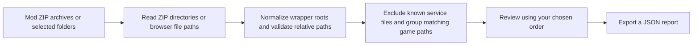

# Mod Conflict Map

**A free, local-first path overlap map for Paradox mods.** Compare ZIP archives or selected mod folders, set the order you want to review, and find game files that appear under the same relative path.

[Open the live app](https://ghostnever-lkm.github.io/paradox-mod-conflict-map/) · [Download v0.4.0](https://github.com/GhosTnever-lkm/paradox-mod-conflict-map/releases/download/v0.4.0/Mod-Conflict-Map-v0.4.0.zip) · [Report an issue](https://github.com/GhosTnever-lkm/paradox-mod-conflict-map/issues)

Current changes are tracked in [CHANGELOG.md](CHANGELOG.md).

## Quick start

1. Use the [live app](https://ghostnever-lkm.github.io/paradox-mod-conflict-map/) or download the complete [v0.4.0 release ZIP](https://github.com/GhosTnever-lkm/paradox-mod-conflict-map/releases/download/v0.4.0/Mod-Conflict-Map-v0.4.0.zip). Keep `index.html`, `styles.css`, `app.js`, and `conflict-core.mjs` together; the app imports the core module.
2. For a local copy, serve that folder over localhost (for example, `python -m http.server 8000`) and open `http://localhost:8000`. Opening `index.html` directly with `file://` may be blocked because browsers restrict JavaScript modules from local files.
3. Add ZIP archives or choose a mod folder. Folder selection can include several mods; if `descriptor.mod` is absent, the selected folder is analyzed as-is. The legacy `foo.mod` plus `foo/` layout is recognized and normalized to the mod folder.
4. Rename entries if needed and arrange them from higher to lower priority with the arrows or by dragging.
5. Expand matching paths to see which archives contain them. Export a JSON report for later review.

### How the analysis works

The selected order is for review only. It does not configure the launcher or claim to reproduce the game's actual override behavior. The app does not change your launcher or mod files, install software, or extract archives.

## What it checks

- Lists entries from ZIP central directories (including safely representable ZIP64 metadata) or folders explicitly selected by you.
- Normalizes path separators, letter case, and a detected common ZIP wrapper such as `ModA/`, so wrapped archives compare by their game-relative paths.
- Removes one wrapper identified by a single `descriptor.mod`. Without one, a shared top-level folder is removed only when it clearly encloses recognized game directories.
- Excludes known service files from comparisons: VCS directories (`.git`, `.svn`, `.hg`), common OS metadata, root README/license/changelog files, root `.mod` descriptors, and common Workshop thumbnail/preview images. The source row reports how many service files were skipped.
- Skips `descriptor.mod` and `.mod` metadata and flags absolute or out-of-root paths instead of including them in the map. The legacy sibling `.mod` plus content folder layout is normalized to its content root.
- Reports duplicate paths within a ZIP or selected folder in both the source list and exported JSON.
- Search the overlap list by normalized file path, mod name, or source archive name; the count shows how many results match. Search filters the on-screen list while JSON export still contains every overlap.
- Adds several nested mods as separate sources. If nested descriptors coexist with files outside them, it keeps the entire selected folder and shows a warning to avoid silently losing files.

## Read the result carefully

A shared path is a **potential file overlap**, not proof that two mods conflict. The app does not inspect file contents, understand Clausewitz data, resolve `replace_path`, evaluate dependencies, determine the active launcher playset, or reproduce a game's merge and override rules. The order is the order you provide for review; verify actual priority behavior for your game and launcher.

It is not antivirus software, a malware scanner, a full mod validator, or a guarantee that an archive is safe. It does not decompress files or verify CRC values. Do not use its report as proof that an archive is trustworthy.

## Limits and privacy

- Maximum compressed archive size: 500 MB each.
- Maximum file entries: 100,000 per archive or selected folder.
- Maximum expanded file size: 1 GB per file and 4 GB total per archive or selected folder. These limits are reported separately from compressed archive size.
- For ZIPs, the app reads only the central directory. For folders, it reads relative paths and file sizes supplied by the browser. It does not upload files, make network requests, load external scripts, or extract archive contents.

These limits keep metadata scans bounded. Very large or malformed archives may be rejected. The browser must have enough memory to read a selected ZIP's central directory.

## Development

No dependencies or build step are required. Serve the repository as static files over localhost; module imports may be blocked by `file://`. Run the regression suite with `node --test`.

## License

MIT. See [LICENSE](LICENSE).

## Support

This project is free and open source. Optional support: [Buy Me a Coffee](https://buymeacoffee.com/azizazimov8) · [Boosty](https://boosty.to/azimovian) · [Gumroad](https://azimovian22.gumroad.com/).
