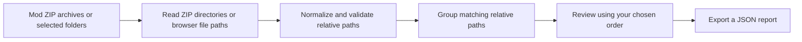

# Mod Conflict Map

**A free, local-first path overlap map for Paradox mods.** Compare ZIP archives or selected mod folders, set the order you want to review, and find files that appear under the same relative path.

[Open the live app](https://ghostnever-lkm.github.io/paradox-mod-conflict-map/) · [Download the latest ZIP](https://github.com/GhosTnever-lkm/paradox-mod-conflict-map/releases/latest/download/Mod-Conflict-Map.zip) · [Report an issue](https://github.com/GhosTnever-lkm/paradox-mod-conflict-map/issues)

Current unreleased changes are tracked in [CHANGELOG.md](CHANGELOG.md).

## Quick start

1. Open the [live app](https://ghostnever-lkm.github.io/paradox-mod-conflict-map/) or download `index.html`, `styles.css`, and `app.js` from this repository.
2. Add ZIP archives or choose the folder of one installed mod. For a folder, select the mod root containing paths such as `common`, `events`, `history`, and `descriptor.mod`. You can also load the built-in example.
3. Rename entries if needed and arrange them from higher to lower priority with the arrows or by dragging.
4. Expand matching paths to see which archives contain them. Export a JSON report for later review.

### How the analysis works

The selected order is for review only. It does not configure the launcher or claim to reproduce the game's actual override behavior.
The app does not change your launcher, mod files, or load order. It does not install, extract, or modify archives. Folder selection is read-only and stays in your browser session.

## What it checks

- Lists file paths from each ZIP central directory, including ZIP64 archives when their metadata can be represented safely by the browser, or from folders you explicitly select.
- Normalizes path separators and letter case to find common paths across archives.
- Shows the chosen review order and the last archive in that list for each shared path.
- Skips `descriptor.mod` metadata files and flags absolute or out-of-root paths instead of including them in the overlap map.
- Reports duplicate paths within a ZIP or selected folder in both the source list and exported JSON.
- If the selected folder contains nested mod roots marked by `descriptor.mod`, each root is added as a separate source and paths are normalized from that mod root. This avoids comparing wrapper names as part of the game path.

## Read the result carefully

A shared path is a **potential file overlap**, not proof that two mods conflict. The application does not inspect file contents, understand Clausewitz data, resolve `replace_path`, evaluate dependencies, determine the active launcher playset, or reproduce a game's merge and override rules. The order is the order you provide for review; verify actual priority behavior for your game and launcher.

It is not antivirus software, a malware scanner, a full mod validator, or a guarantee that an archive is safe. It does not decompress files or verify CRC values. Do not use its report as proof that an archive is trustworthy.

## Limits and privacy

- Maximum compressed archive size: 500 MB each.
- Maximum file entries: 100,000 per archive or selected folder.
- Maximum expanded file size: 1 GB per file and 4 GB total per archive or selected folder. These limits are reported separately from the compressed archive size limit.
- For ZIPs, the app reads only the central directory. For folders, it reads relative paths and file sizes supplied by the browser. It does not upload files, make network requests, load external scripts, or extract archive contents.

These limits keep metadata scans bounded. Very large or malformed archives may be rejected. The browser must have enough memory to read the selected ZIP's central directory.

## Development

No dependencies or build step are required. Open `index.html` or serve the repository as static files. The app uses plain HTML, CSS, and JavaScript. Run the pure logic regression tests with `node --test`.

## License

MIT. See [LICENSE](LICENSE).

## Support

This project is free and open source. Optional support: [Buy Me a Coffee](https://buymeacoffee.com/azizazimov8) · [Boosty](https://boosty.to/azizazimov) · [Gumroad](https://azimovian22.gumroad.com/).
